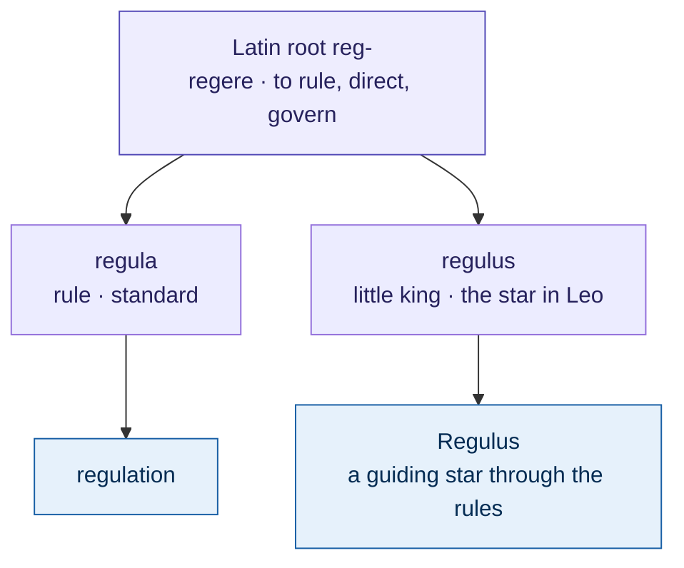
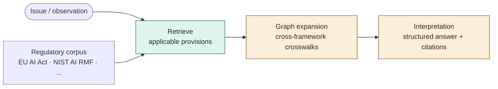
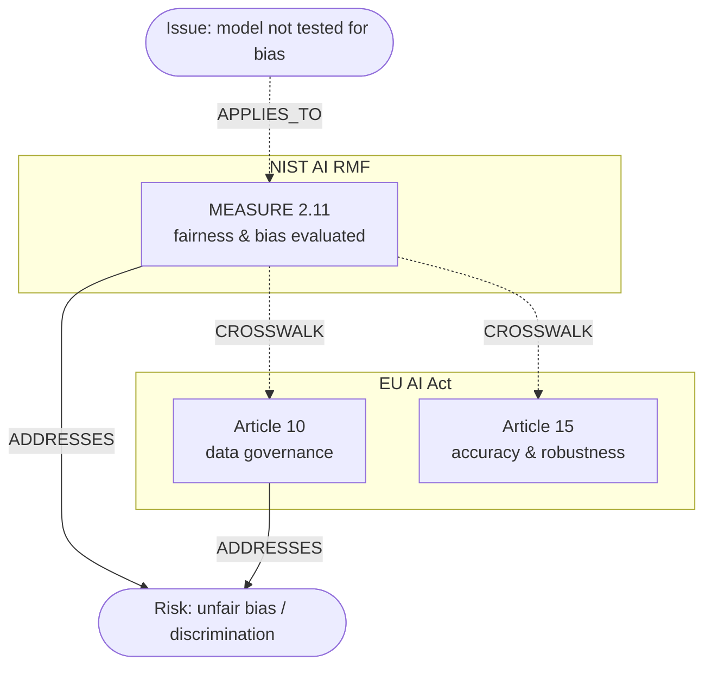
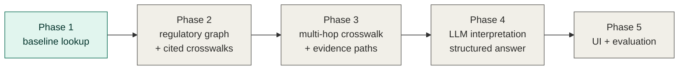

<div align="center">

# ⚖️ Regulus

**AI governance standards lookup, powered by RAG and knowledge graphs.**

[](LICENSE)
[](https://www.python.org/downloads/)
[]()
[]()
[](https://github.com/minw0607/geometric_knowledge_network)

*Submit an issue or observation → get applicable risks, regulatory provisions, and cross-referenced guidance — with citations.*

</div>

---

> Describe an AI issue in plain language — *"our credit model was deployed without testing for demographic bias"* — and Regulus returns the **provisions that apply**, across frameworks like the **EU AI Act**, **NIST AI RMF**, and Federal Reserve **SR** guidance, each with a **source citation** and (as the graph layer lands) a **traceable evidence path** across frameworks.

---

## Contents

- [The name](#-the-name)
- [Why Regulus](#-why-regulus)
- [How it works](#-how-it-works)
- [The knowledge model](#-the-knowledge-model)
- [Status](#-status)
- [Quick start](#-quick-start)
- [Roadmap](#-roadmap)
- [Relationship to GKN](#-relationship-to-gkn)
- [Data and licensing](#-data-and-licensing)

---

## 🌟 The name

**Regulus** means *"little king"* (Latin, diminutive of *rex*), and it is the brightest star in the constellation Leo — historically one of the "royal stars" used to navigate. It shares the Latin root **reg‑** (*regere*, "to rule, direct, govern") with **regula** ("rule, standard"), the source of *regulation*. So the name lands on all three ideas at once — **govern**, **rules**, and a **guiding star** through them:



That is the intent: a system that helps you *navigate* the growing sky of AI rules and standards.

---

## 🎯 Why Regulus

Governance and model-risk questions are **structure** problems, not similarity problems: *which* standard applies to an issue, *how* it maps across frameworks, and *why* — with a defensible citation. That is exactly where a plain vector search is weak and a **knowledge graph over regulatory text** is strong.

- **Cross-framework by design.** A single issue rarely lives in one framework. Regulus links equivalent provisions across the EU AI Act, NIST AI RMF, SR guidance, and more.
- **Traceable, not generative-by-default.** Every provision returned is a real, cited unit of an official framework. Cross-framework mappings (crosswalks) are curated/sourced with provenance — **never hallucinated**. A governance tool that invents regulatory mappings is a liability.
- **Built on a proven substrate.** Regulus is the flagship application of the [Geometric Knowledge Network (GKN)](https://github.com/minw0607/geometric_knowledge_network) — the retrieval + knowledge-graph engine developed specifically for this class of typed-relation, evidence-path problems.

---

## 🧭 How it works

Regulus ingests **real** regulatory texts from official sources, splits them into citable **provisions**, and indexes them on the GKN substrate. An issue is matched to the most applicable provisions; the knowledge-graph layer then expands to cross-referenced guidance in other frameworks and returns the evidence path.



<div align="center"><sub>🟩 working today &nbsp;·&nbsp; 🟧 planned (graph + interpretation layers)</sub></div>

---

## 🧩 The knowledge model

Under the retrieval layer, Regulus builds a **regulatory knowledge graph**. The payoff is the **`CROSSWALK`** edge — the same concern, linked across frameworks — plus a traceable path from an issue to the provisions that govern it. A concrete slice:



<div align="center"><sub>Illustrative — crosswalk edges must be authoritative and cited, not inferred.</sub></div>

**Node types** — `Framework` · `Provision` (article / control / subcategory) · `RiskCategory` · `Issue` · `Guidance` · `LifecycleStage`

**Edge types** — `CONTAINS` (framework→provision) · `ADDRESSES` / `MITIGATES` (provision→risk) · `CROSSWALK` (provision↔provision across frameworks, **cited**) · `REQUIRES` · `APPLIES_TO` (provision→issue) · `CITES` · `INTERPRETS`

---

## 📍 Status

Early MVP — **Phase 1 (baseline lookup) works end-to-end on real data.**

| Capability | State |
|---|:--:|
| Ingest real **EU AI Act** (EUR-Lex, 113 articles) | ✅ |
| Ingest real **NIST AI RMF 1.0** (PDF, 72 subcategories) | ✅ |
| Download + cache with provenance | ✅ |
| Issue → applicable provisions (TF-IDF or embeddings) | ✅ |
| CLI (`regulus ingest` / `lookup`) | ✅ |
| Regulatory knowledge graph + cited crosswalks | 🔜 |
| Cross-framework evidence paths | 🔜 |
| LLM interpretation / structured answer | 🔜 |
| Web UI | 🔜 |

Even the dependency-light TF-IDF baseline already surfaces the right provisions:

| Issue | Top provision returned |
|---|---|
| *"real-time facial recognition in public spaces for law enforcement"* | **EU AI Act, Article 5** — prohibited AI practices |
| *"model deployed without testing for demographic bias"* | **NIST AI RMF, MEASURE 2.11** — fairness & bias |

---

## 🚀 Quick start

```bash
python -m venv .venv && source .venv/bin/activate
pip install -e .          # installs Regulus + GKN (from git)
```

```bash
regulus frameworks                                  # list supported frameworks
regulus ingest --frameworks eu_ai_act,nist_ai_rmf   # download + parse (cached under data/)
regulus lookup "our model was not validated for demographic bias" --top-k 5
```

The default `tfidf` retriever needs no API keys. For embedding-quality retrieval (delegates to GKN's embedding store — Azure/OpenAI or local), set `REGULUS_RETRIEVER=embedding` in `.env` (see `.env.example`). A full walkthrough is in [`notebooks/01_ingest_and_lookup.ipynb`](notebooks/01_ingest_and_lookup.ipynb).

---

## 🗺 Roadmap



- **Phase 1 — baseline lookup** *(done)*: ingest real frameworks, issue → provisions with citations.
- **Phase 2 — regulatory graph**: frameworks / provisions / risks + curated, **cited** crosswalks.
- **Phase 3 — multi-hop + crosswalk**: issue → applicable provisions → cross-framework references → evidence paths (via GKN's multi-hop retriever + path explainer).
- **Phase 4 — interpretation**: LLM synthesis over retrieved provisions + paths → structured answer (risks · standards · cross-refs · guidance · citations).
- **Phase 5 — interface + eval**: "submit an issue" UI; a benchmark of issue → expected-standards and crosswalk accuracy.

---

## 🔗 Relationship to GKN

[GKN](https://github.com/minw0607/geometric_knowledge_network) is the reusable retrieval / knowledge-graph substrate; **Regulus is its flagship governance application.** Regulus depends on GKN as a package and reuses its chunking, vector store, knowledge-graph builder, **multi-hop retriever**, and **path explainer** (the "why does this apply" evidence trail). GKN stays domain-agnostic; Regulus adds the regulatory schema, the standards corpus, and the lookup / interpretation layer.

---

## 📄 Data and licensing

Regulus fetches text from official sources at runtime and caches it locally (git-ignored) — it does **not** redistribute regulatory text in this repository.

- **EU AI Act** — EUR-Lex (© European Union; reuse permitted with attribution).
- **NIST AI RMF 1.0** — NIST publication (U.S. Government work).
- **Fed SR letters / ISO 42001** — registered for the roadmap; ISO text is paywalled and referenced by structure only.

Always verify against the authoritative source before relying on any result. Licensed under the [MIT License](LICENSE).
