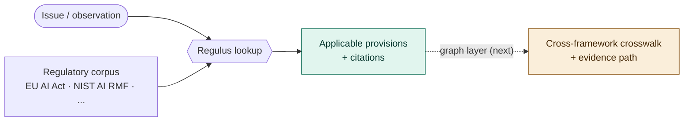

<div align="center">

# ⚖️ Regulus

**AI governance standards lookup, powered by RAG and knowledge graphs.**

[](LICENSE)
[](https://www.python.org/downloads/)
[]()
[](https://github.com/minw0607/geometric_knowledge_network)

*Submit an issue or observation → get applicable risks, regulatory provisions, and cross-referenced guidance — with citations.*

</div>

---

> Describe an AI issue in plain language — *"our credit model was deployed without testing for demographic bias"* — and Regulus returns the **provisions that apply**, across frameworks like **NIST AI RMF**, the **EU AI Act**, and Federal Reserve **SR** guidance, each with a **source citation** and (as the graph layer lands) a **traceable evidence path**.

---

## Contents

- [Why Regulus](#-why-regulus)
- [How it works](#-how-it-works)
- [Status](#-status)
- [Quick start](#-quick-start)
- [The regulatory knowledge model](#-the-regulatory-knowledge-model)
- [Roadmap](#-roadmap)
- [Relationship to GKN](#-relationship-to-gkn)
- [Data and licensing](#-data-and-licensing)

---

## 🎯 Why Regulus

Governance and model-risk questions are **structure** problems, not similarity problems: *which* standard applies to this issue, *how* it maps across frameworks, and *why* — with a defensible citation. That is exactly where a plain vector search is weak and a **knowledge graph over regulatory text** is strong. Regulus is the applied product built on the [Geometric Knowledge Network (GKN)](https://github.com/minw0607/geometric_knowledge_network) substrate.

A governance tool must **never invent regulatory mappings**. Every provision Regulus returns is a real, cited unit of an official framework, and cross-framework mappings (crosswalks) are curated/sourced with provenance — not hallucinated.

---

## 🧭 How it works



Regulus ingests **real** regulatory texts from official sources, splits them into citable **provisions**, and indexes them on the GKN retrieval substrate. An issue is matched to the most applicable provisions; the knowledge-graph layer (next phase) then expands to cross-referenced guidance in other frameworks and returns the evidence path.

---

## 📍 Status

Early MVP — **Phase 1 (baseline lookup) works end-to-end on real data**:

| Capability | State |
|---|---|
| Ingest real **EU AI Act** (EUR-Lex, 113 articles) | ✅ |
| Ingest real **NIST AI RMF 1.0** (PDF, 72 subcategories) | ✅ |
| Download + cache with provenance | ✅ |
| Issue → applicable provisions (TF-IDF or embeddings) | ✅ |
| CLI (`regulus ingest` / `lookup`) | ✅ |
| Regulatory knowledge graph + crosswalks | 🔜 |
| Cross-framework evidence paths | 🔜 |
| LLM interpretation / structured answer | 🔜 |
| Web UI | 🔜 |

*Even the TF-IDF baseline already surfaces the right provisions — e.g. a facial-recognition-in-public-spaces issue returns EU AI Act Article 5 (prohibited practices); a bias-testing gap returns NIST AI RMF MEASURE 2.11.*

---

## 🚀 Quick start

```bash
python -m venv .venv && source .venv/bin/activate
pip install -e .          # installs Regulus + GKN (from git)
```

```bash
# List supported frameworks
regulus frameworks

# Download + parse real frameworks into provisions (cached under data/)
regulus ingest --frameworks eu_ai_act,nist_ai_rmf

# Ask a question
regulus lookup "our model was not validated for demographic bias" --top-k 5
```

Higher-quality retrieval with embeddings (delegates to GKN's embedding store, Azure/OpenAI or local): set `REGULUS_RETRIEVER=embedding` in `.env` (see `.env.example`). The default `tfidf` retriever needs no API keys. A walkthrough is in `notebooks/01_ingest_and_lookup.ipynb`.

---

## 🧩 The regulatory knowledge model

The graph layer (next phase) specializes the GKN schema for regulation:

- **Nodes:** `Framework` · `Provision` (article/control/subcategory) · `RiskCategory` · `Issue` · `Guidance` · `LifecycleStage`
- **Edges:** `CONTAINS` (framework→provision) · `ADDRESSES`/`MITIGATES` (provision→risk) · `CROSSWALK` (provision↔provision across frameworks, **cited**) · `REQUIRES` · `APPLIES_TO` (provision→issue) · `CITES` · `INTERPRETS`

The `CROSSWALK` edges are the differentiator — e.g. NIST AI RMF `MEASURE 2.11` (fairness) ↔ EU AI Act `Article 10` (data governance) ↔ model-risk validation guidance — and they must be **authoritative and cited**.

---

## 🗺 Roadmap

- **Phase 1 — baseline lookup** *(done)*: ingest real frameworks, issue → provisions with citations.
- **Phase 2 — regulatory graph**: build frameworks/provisions/risks; curated, cited crosswalks.
- **Phase 3 — multi-hop + crosswalk**: issue → applicable provisions → cross-framework references → evidence paths (via GKN's multi-hop retriever + path explainer).
- **Phase 4 — interpretation**: LLM synthesis over retrieved provisions + paths → structured answer (risks · standards · cross-refs · guidance · citations).
- **Phase 5 — interface + eval**: "submit an issue" UI; a benchmark of issue → expected-standards and crosswalk accuracy.

---

## 🔗 Relationship to GKN

[GKN](https://github.com/minw0607/geometric_knowledge_network) is the reusable retrieval/graph substrate; Regulus is its flagship governance application. Regulus depends on GKN as a package and reuses its chunking, vector store, knowledge-graph builder, **multi-hop retriever**, and **path explainer** (the "why does this apply" evidence trail). GKN stays domain-agnostic; Regulus adds the regulatory schema, the standards corpus, and the lookup/interpretation layer.

---

## 📄 Data and licensing

Regulus fetches text from official sources at runtime and caches it locally (git-ignored) — it does **not** redistribute regulatory text in this repo.

- **EU AI Act** — EUR-Lex (© European Union; reuse permitted with attribution).
- **NIST AI RMF 1.0** — NIST publication (U.S. Government work).
- **Fed SR letters / ISO 42001** — registered for the roadmap; ISO text is paywalled and referenced by structure only.

Always verify against the authoritative source before relying on any result. This project is licensed under the [MIT License](LICENSE).
