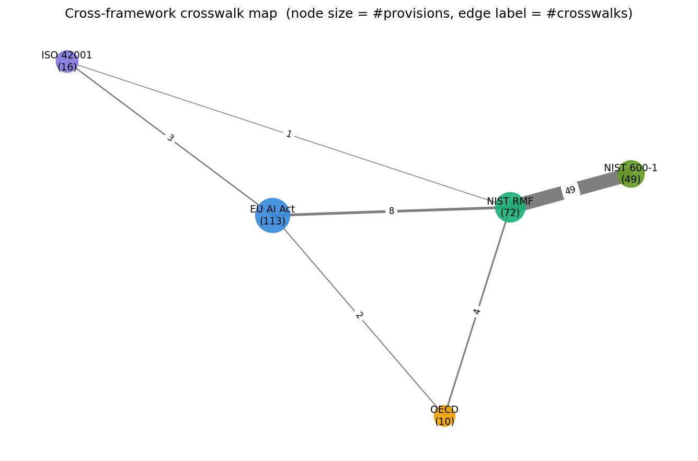
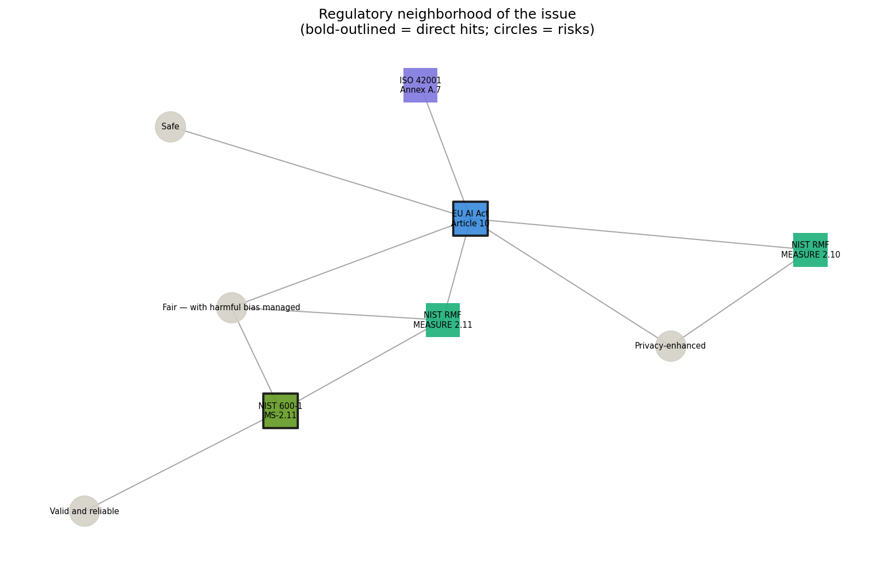
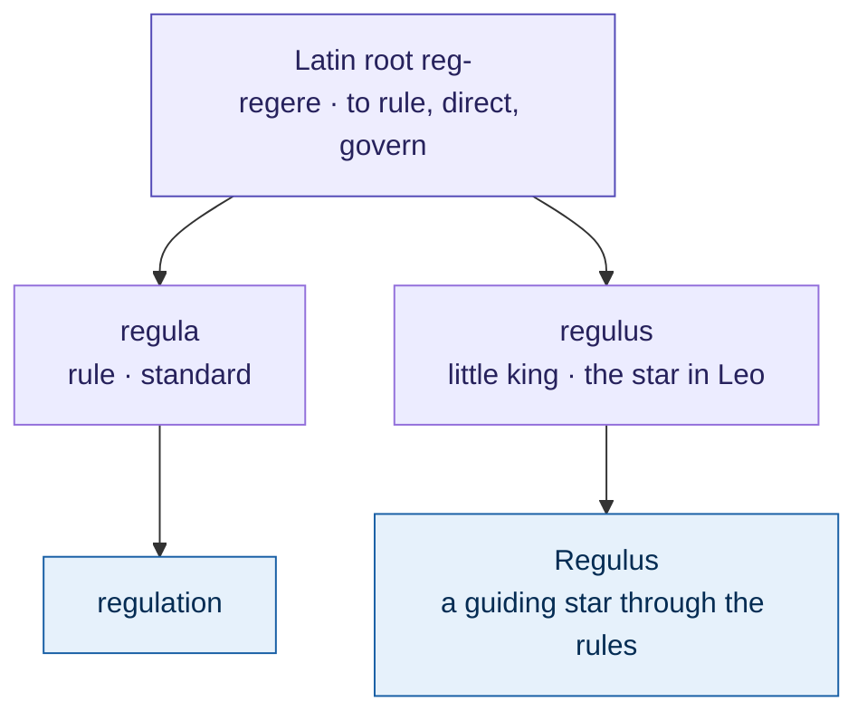
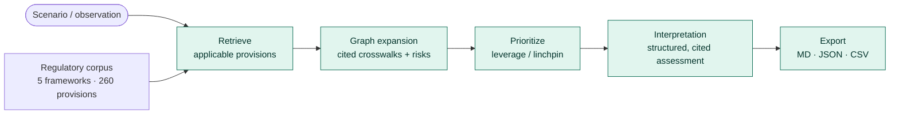
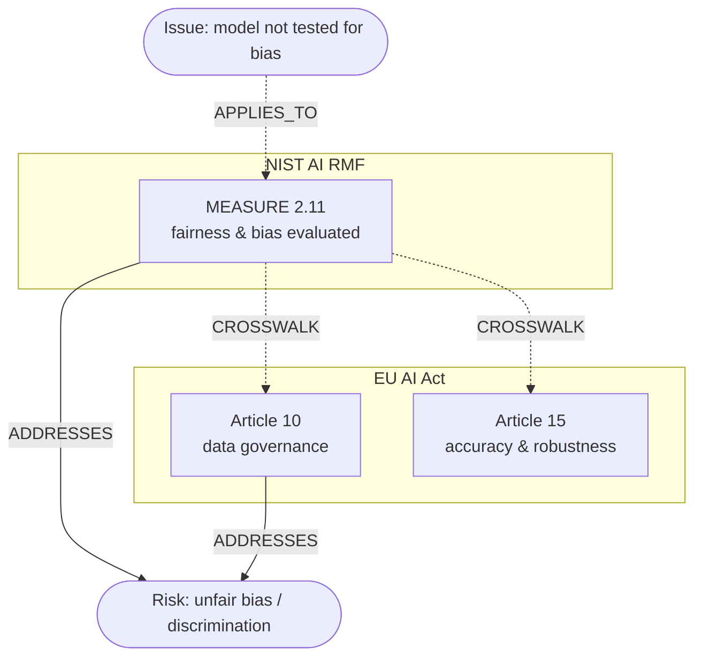
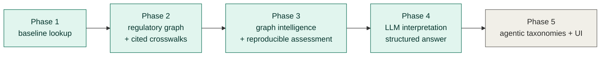

<div align="center">

# ⚖️ Regulus

**Domain-specialized GraphRAG for AI governance — retrieval + a cited cross-framework knowledge network + grounded LLM interpretation.**

[](LICENSE)
[](https://www.python.org/downloads/)
[]()
[]()
[](https://github.com/minw0607/geometric_knowledge_network)

*Describe an AI system and a scenario → get the **risks**, the **applicable provisions across frameworks** (and why), **what to address first**, and **recommended mitigants** — cited, reproducible, and exportable.*

</div>

---

> Describe an AI issue in plain language — *"our credit model was deployed without testing for demographic bias"* — and Regulus returns the **provisions that apply** across the **EU AI Act**, **NIST AI RMF & GenAI Profile**, **OECD Principles**, **ISO/IEC 42001**, **MITRE ATLAS**, and the **OWASP Top 10 for LLM**, each with a **source citation**, links them through a **cited cross-framework knowledge graph**, and interprets them into a structured, grounded assessment. For security scenarios it chains **regulation → threat technique → concrete mitigation**, with the *signal* (relation + rationale + provenance) shown at every hop.

---

## ✨ See it in action

**The knowledge network — 475 provisions across 7 frameworks (regulatory + threat layers), linked by 400 cited edges:**

<div align="center">

</div>

**One scenario's regulatory neighborhood** — the same bias concern expressed across four frameworks. Bold-outlined squares are the direct retrieval hits; plain squares are provisions the graph reaches via cited crosswalks; grey circles are the risks they address:

<div align="center">

</div>

**Why the graph beats flat RAG — measured, not asserted** (`reg.compare_rag(scenario)`, prompt-injection scenario):

| dimension | flat RAG (similarity only) | Regulus GraphRAG |
|---|:--:|:--:|
| provisions surfaced | 5 | **44** |
| frameworks covered | 3 | **6** |
| cross-framework links used | 0 | **16** |
| risks identified | 0 | **4** |
| prioritized "address-first" | — | **leverage-ranked linchpin** |

Similarity clusters *within a framework*; the graph follows cited crosswalks — including **multi-hop chains with a signal at every step**:

> EU AI Act **Article 15** → *(Art 15(5) names "adversarial examples or model evasion")* → ATLAS **Craft Adversarial Data** → *(mitigates: "hardened models are more robust to adversarial inputs")* → ATLAS **Model Hardening**

That is a *regulation → threat → control* chain no similarity search produces — every hop cited, every link explained.

**And the fair test** (`reg.evaluate_cross_framework()`): 10 labelled cases whose expected provisions span ≥2 frameworks; flat RAG retrieves over the *whole* corpus with the same retriever and k; the graph adds cited crosswalk expansion. Result (TF-IDF baseline, deterministic):

| | flat RAG | + knowledge graph |
|---|:--:|:--:|
| cross-framework recall@5 | 0.55 | **1.00** |
| expected frameworks found (avg of ~2.8) | 1.5 | **2.8** |

A blind, LLM-judged answer-quality A/B (`reg.ab_report()`) complements this: same model, temperature 0, same provisions — the only difference is whether the context carries the graph's typed relationships.

**Structured, reproducible assessment** (`reg.assess(scenario)`) — risk × standards × control, e.g.:

| risk | relevant provisions (standards) | suggested control / mitigant |
|---|---|---|
| Fair — bias managed | EU AI Act Art 10 · NIST RMF MEASURE 2.11 | Test outcomes for disparate impact; govern training data for bias |
| Accountable & transparent | EU AI Act Art 12 · NIST 600-1 GV-4.2 | Logging/record-keeping and clear ownership across the lifecycle |

Every run of the same scenario produces the **same core** (risks, provisions, controls, priority); only the LLM's prose narrative can vary. Export to Markdown + JSON + CSV with `reg.assess(scenario, export=True)`.

---

## Contents

- [The name](#-the-name)
- [Why Regulus](#-why-regulus)
- [How it works](#-how-it-works)
- [The knowledge model](#-the-knowledge-model)
- [Status](#-status)
- [Quick start](#-quick-start)
- [Roadmap](#-roadmap)
- [Relationship to GKN](#-relationship-to-gkn)
- [Data and licensing](#-data-and-licensing)

---

## 🌟 The name

**Regulus** means *"little king"* (Latin, diminutive of *rex*), and it is the brightest star in the constellation Leo — historically one of the "royal stars" used to navigate. It shares the Latin root **reg‑** (*regere*, "to rule, direct, govern") with **regula** ("rule, standard"), the source of *regulation*. So the name lands on all three ideas at once — **govern**, **rules**, and a **guiding star** through them:


```mermaid
flowchart TD
    ROOT["Latin root reg-<br/>regere · to rule, direct, govern"]
    ROOT --> REGULA["regula<br/>rule · standard"]
    ROOT --> REGULUS["regulus<br/>little king · the star in Leo"]
    REGULA --> REGULATION["regulation"]
    REGULUS --> NAME["Regulus<br/>a guiding star through the rules"]
    classDef root fill:#eeedfe,stroke:#534ab7,color:#26215c;
    classDef leaf fill:#e6f1fb,stroke:#185fa5,color:#042c53;
    class ROOT root
    class REGULATION,NAME leaf
```

That is the intent: a system that helps you *navigate* the growing sky of AI rules and standards.

---

## 🎯 Why Regulus

Governance and model-risk questions are **structure** problems, not similarity problems: *which* standard applies to an issue, *how* it maps across frameworks, *why* — with a defensible citation — and *which provision to fix first*. That is exactly where a plain vector search is weak and a **knowledge graph over regulatory text** is strong.

- **Cross-framework by design.** A single issue rarely lives in one framework. Regulus links equivalent provisions across the EU AI Act, NIST AI RMF, NIST GenAI Profile, OECD, and ISO/IEC 42001 — including *multi-hop* reach that flat similarity retrieval misses entirely.
- **Traceable, not generative-by-default.** Every provision returned is a real, cited unit of an official framework. Cross-framework mappings (crosswalks) are curated with provenance — **never hallucinated**. A governance tool that invents regulatory mappings is a liability.
- **Reproducible.** The facts a reviewer relies on (risks, provisions, controls, priority) are computed by code from a single retrieval pass over a fixed data store — identical every run. Only the labeled LLM narrative can vary, and it runs at temperature 0 over the exact same provisions.
- **Built on a proven substrate.** Regulus is the flagship application of the [Geometric Knowledge Network (GKN)](https://github.com/minw0607/geometric_knowledge_network) — the retrieval + knowledge-graph engine developed for this class of typed-relation, evidence-path problems.

**Positioning.** Regulus is not a full GRC platform (Credo AI, Holistic AI, watsonx.governance, OneTrust). Its edge is **transparency and traceability**: auditable open crosswalks, a reproducible deterministic core, and method rigor — valuable as a transparent internal model-risk tool. The moat is crosswalk-curation quality.

---

## 🧭 How it works

Regulus ingests **real** regulatory texts from official sources, splits them into citable **provision-scoped units**, and indexes them on the GKN substrate. A scenario is matched to the most applicable provisions; the knowledge-graph layer expands to cross-referenced guidance in other frameworks, ranks provisions by leverage, and an LLM interprets the result into a grounded, cited assessment.


```mermaid
flowchart LR
    I(["Scenario / observation"]) --> RET["Retrieve<br/>applicable provisions"]
    C["Regulatory corpus<br/>5 frameworks · 260 provisions"] --> RET
    RET --> G["Graph expansion<br/>cited crosswalks + risks"]
    G --> PRI["Prioritize<br/>leverage / linchpin"]
    PRI --> INT["Interpretation<br/>structured, cited assessment"]
    INT --> EX["Export<br/>MD · JSON · CSV"]
    classDef now fill:#e1f5ee,stroke:#0f6e56,color:#04342c;
    class RET,G,PRI,INT,EX now
```

<div align="center"><sub>🟩 all stages work end-to-end today</sub></div>

---

## 🧩 The knowledge model

Under the retrieval layer, Regulus builds a **regulatory knowledge graph**. The payoff is the **`CROSSWALK`** edge — the same concern, linked across frameworks — plus a traceable path from an issue to the provisions that govern it. A concrete slice:


```mermaid
flowchart TD
    ISS(["Issue: model not tested for bias"])
    RISK(["Risk: unfair bias / discrimination"])
    subgraph NIST["NIST AI RMF"]
        N["MEASURE 2.11<br/>fairness & bias evaluated"]
    end
    subgraph EU["EU AI Act"]
        A10["Article 10<br/>data governance"]
        A15["Article 15<br/>accuracy & robustness"]
    end
    ISS -. APPLIES_TO .-> N
    N -- ADDRESSES --> RISK
    A10 -- ADDRESSES --> RISK
    N -. CROSSWALK .-> A10
    N -. CROSSWALK .-> A15
```

<div align="center"><sub>Illustrative — crosswalk edges must be authoritative and cited, not inferred.</sub></div>

This graph is **built today** from the ingested corpus plus a curated, cited crosswalk table ([`data/crosswalks/`](data/crosswalks/)). Run `regulus graph` for a summary, or `regulus lookup "..." --crosswalks` to see an issue's applicable provisions annotated with the risks they address and their cross-framework references — each with its citation. `CROSSWALK` edges come *only* from the curated table (never inferred); `ADDRESSES` risk tags are keyword-derived and marked low-confidence.

**Node types** — `Framework` · `Provision` (article / control / subcategory / threat technique / mitigation) · `RiskCategory`

**Edge types** — `CONTAINS` (framework→provision) · `ADDRESSES` (provision→risk, keyword-derived) · `CROSSWALK` (provision↔provision, **cited**; includes `equivalent`/`related` cross-framework mappings and MITRE ATLAS's authoritative `mitigates`/`specializes` links, each carrying its own rationale — the *signal* shown at every hop)

---

## 📍 Status

**Working MVP — the full pipeline runs end-to-end on real data:** retrieval → cited crosswalk graph → leverage prioritization → grounded, reproducible LLM assessment → export.

**Frameworks ingested (475 provisions, 400 cited crosswalk/mitigation edges):**

| Framework | Provisions | State |
|---|---|:--:|
| EU AI Act | 113 articles | ✅ real text (EUR-Lex) |
| NIST AI RMF 1.0 | 72 subcategories | ✅ real text (PDF) |
| NIST AI 600-1 (GenAI Profile) | 49 action groups | ✅ real text (PDF), keyed to the AI RMF |
| OECD AI Principles | 10 | ✅ real text (OECD/LEGAL/0449) |
| ISO/IEC 42001:2023 | 16 clauses/controls | ✅ structure only (paywalled) |
| **MITRE ATLAS** (threat layer) | 170 techniques + 35 mitigations | ✅ machine-readable `ATLAS.yaml` — incl. **authoritative mitigation→technique edges with per-link rationales** |
| **OWASP Top 10 for LLM (2025)** | 10 risks incl. preventions | ✅ official per-risk markdown (CC BY-SA 4.0) |
| OWASP Agentic AI (T1–T17 / ASI) | — | 🔜 next |
| Fed SR 26-2 (supersedes SR 11-7) | — | 🔜 needs manual sourcing |

| Capability | State |
|---|:--:|
| Download + cache with provenance (+ snapshot fallback, no `pypdf` needed) | ✅ |
| Provision-aware indexing · TF-IDF or embeddings (`auto`) | ✅ |
| Regulatory knowledge graph + cited crosswalks | ✅ |
| Grounded, cited **LLM interpretation** (dry-run without a key) | ✅ |
| **Reproducible structured assessment** (risk × standards × control) + export (MD/JSON/CSV) | ✅ |
| **Graph intelligence** — multi-hop reach · leverage/linchpin · flat-RAG-vs-GraphRAG | ✅ |
| **Layer-aware retrieval** (regulatory + threat anchors both kept in top-k) | ✅ |
| **Cross-framework eval** (flat vs graph recall on ≥2-framework cases) | ✅ |
| **Blind answer-quality A/B** (LLM judge, temperature 0, randomized labels) | ✅ |
| **Evidence paths** (node —[signal]→ node chains in every assessment) | ✅ |
| Coverage report across a categorized scenario set | ✅ |
| Retrieval eval (hit / recall@k / MRR) | ✅ |
| Web UI | 🔜 |

**Measured retrieval quality** (provision-aware indexing; 12 regulatory cases with embeddings: **hit 1.00 · recall@5 0.92 · MRR 0.94**; the eval set now spans 16 cases including security/threat phrasing — tracked in the notebook). Examples:

| Issue | Top provision returned |
|---|---|
| *"real-time facial recognition in public spaces for law enforcement"* | **EU AI Act, Article 5** — prohibited AI practices |
| *"model deployed without testing for demographic bias"* | **NIST GenAI MEASURE 2.11 / EU AI Act Article 10** |

---

## 🚀 Quick start

```bash
python -m venv .venv && source .venv/bin/activate
pip install -e .          # installs Regulus + GKN (from git)
```

**CLI:**

```bash
regulus frameworks                                  # list supported frameworks
regulus ingest --frameworks eu_ai_act,nist_ai_rmf   # download + parse (cached under data/)
regulus lookup "our model was not validated for demographic bias" --top-k 5 --crosswalks
```

**Python (the one-call facade):**

```python
from regulus.system import RegulusSystem

reg = RegulusSystem.launch(target_system="A credit-scoring model for consumer loans.")
reg.overview()                       # app card: models, data store, KN structure, I/O
reg.assess("model deployed without testing for demographic bias", export=True)
reg.compare_rag("...")               # flat RAG vs GraphRAG, measured
```

The default `auto` retriever uses embeddings when an `OPENAI_API_KEY` is available (reused from a sibling GKN `.env`) and TF-IDF otherwise — no API key required to run. For the LLM interpretation layer, `pip install openai`; without it, `assess()` still returns the full deterministic core. The end-to-end walkthrough is in [`notebooks/regulus_ai_governance_lookup.ipynb`](notebooks/regulus_ai_governance_lookup.ipynb) — it self-bootstraps GKN from the local checkout, so it runs without a `pip install`.

---

## 🗺 Roadmap


```mermaid
flowchart LR
    P1["Phase 1<br/>baseline lookup"] --> P2["Phase 2<br/>regulatory graph<br/>+ cited crosswalks"]
    P2 --> P3["Phase 3<br/>graph intelligence<br/>+ reproducible assessment"]
    P3 --> P4["Phase 4<br/>LLM interpretation<br/>structured answer"]
    P4 --> P5["Phase 5<br/>agentic taxonomies + UI"]
    classDef done fill:#e1f5ee,stroke:#0f6e56,color:#04342c;
    classDef todo fill:#f1efe8,stroke:#5f5e5a,color:#2c2c2a;
    class P1,P2,P3,P4 done
    class P5 todo
```

- **Phase 1 — baseline lookup** *(done)*: ingest real frameworks, issue → provisions with citations.
- **Phase 2 — regulatory graph** *(done)*: frameworks / provisions / risks + curated, **cited** crosswalks.
- **Phase 3 — graph intelligence + assessment** *(done)*: multi-hop crosswalk reach, leverage/linchpin prioritization, flat-RAG-vs-GraphRAG comparison, and a reproducible risk × standards × control assessment with export.
- **Phase 4 — interpretation** *(done)*: grounded, cited LLM synthesis over the retrieved provisions + relationships.
- **Phase 5 — agentic taxonomies + UI** *(next)*: OWASP Agentic AI threats (T1–T17) and Top 10 for Agentic Applications; replacing seed crosswalks with authoritative mappings (NIST AIRC crosswalks); a "submit an issue" web UI; a larger issue → expected-standards benchmark. (Evidence paths shipped early — every assessment now renders node —[signal]→ node chains.)

---

## 🔗 Relationship to GKN

[GKN](https://github.com/minw0607/geometric_knowledge_network) is the reusable retrieval / knowledge-graph substrate; **Regulus is its flagship governance application.** Regulus depends on GKN as a package and reuses its chunking, vector store, and knowledge-graph tooling; the planned evidence-path layer will reuse GKN's **multi-hop retriever** and **path explainer**. GKN stays domain-agnostic; Regulus adds the regulatory schema, the standards corpus, provision-aware indexing, the crosswalk curation, and the assessment / interpretation layer.

---

## 📄 Data and licensing

Regulus fetches text from official sources at runtime and caches it locally (git-ignored) — it does **not** redistribute regulatory text in this repository (committed snapshots contain parsed structure/titles for offline demo use).

- **EU AI Act** — EUR-Lex (© European Union; reuse permitted with attribution).
- **NIST AI RMF 1.0 / AI 600-1** — NIST publications (U.S. Government work).
- **OECD AI Principles** — OECD/LEGAL/0449.
- **ISO/IEC 42001** — paywalled; referenced by structure only.
- **Fed SR letters** — registered for the roadmap; needs manual sourcing.

Always verify against the authoritative source before relying on any result. Licensed under the [MIT License](LICENSE).
